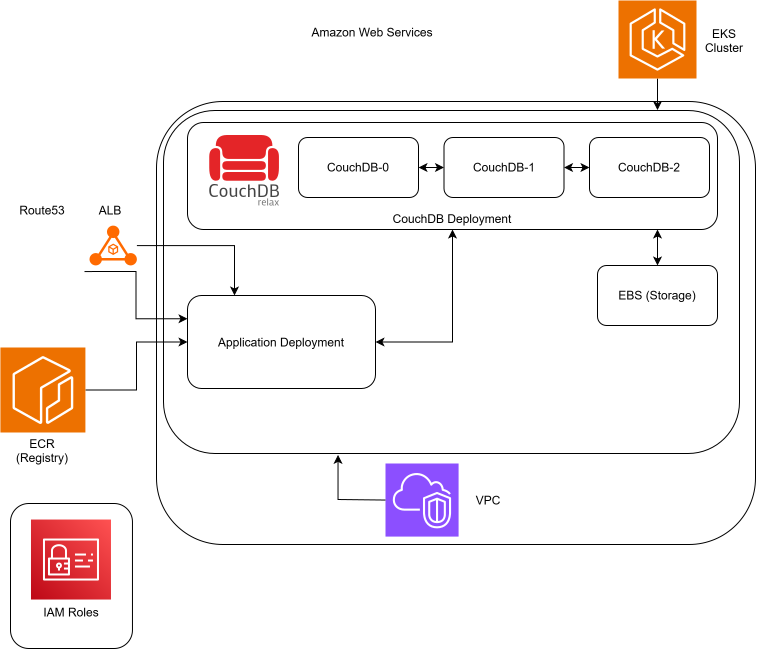

# Table of Contents

- [Infrastructure](#infrastructure)
- [CouchDB](#couchdb)
- [Front End](#front-end)
- [Back End](#back-end)
- [GitHub Actions](#github-actions)
- [Pre Commits](#pre-commits)

## Infrastructure



The infrastructure is deployed on AWS using EKS, with CouchDB for data storage and an Application Load Balancer for HTTPS traffic routing via Route53.

### Route53

AWS Route53 provides DNS management for the application. It creates a CNAME record pointing to the Application Load Balancer, enabling access via a custom domain (recipeshare.com619.v2xinterconnect.com). ACM certificate validation records are also managed through Route53.

### Application Load Balancer (ALB)

The ALB handles incoming HTTPS traffic on port 443 and HTTP traffic on port 80 (with automatic SSL redirect). It's provisioned by the AWS Load Balancer Controller running in the EKS cluster and uses an ACM certificate for SSL/TLS termination. The Ingress resource routes traffic to the com619-service.

### VPC (Virtual Private Cloud)

A custom VPC (192.168.0.0/16) provides network isolation with:

- 2 Public Subnets (192.168.0.0/18, 192.168.64.0/18) across different availability zones
- 2 Private Subnets (192.168.128.0/18, 192.168.192.0/18) for EKS worker nodes
- Internet Gateway for public subnet internet access
- 2 NAT Gateways (one per AZ) with Elastic IPs for private subnet outbound traffic
- Route tables managing traffic flow between subnets

The VPC is based on AWS' suggested VPC Stack see, [VPC for EKS Cluster | AWS EKS](https://docs.aws.amazon.com/eks/latest/userguide/creating-a-vpc.html).

### EKS Cluster

Amazon EKS (Elastic Kubernetes Service) orchestrates containerized applications with:

- Cluster control plane managed by AWS
- Node group with 2-4 t2.medium Bottlerocket instances
- EKS add-ons: CoreDNS, kube-proxy, aws-ebs-csi-driver
- OIDC provider for IAM role integration

### ECR (Elastic Container Registry)

Stores Docker images for the frontend application. The deployment pipeline builds images locally, authenticates with ECR, and pushes tagged images (com619app:latest). The EKS cluster pulls images using an ecr-registry-secret.

### Application Deployment

Kubernetes Deployment running the Next.js frontend application:

- 1 replica pulling from ECR
- Exposed via NodePort service (com619-service) on port 3000
- Resource limits: 500m CPU, 512Mi memory
- Connects to CouchDB for data persistence

### CouchDB StatefulSet

A 3-node CouchDB cluster for distributed data storage:

- StatefulSet with pods: couchdb-0, couchdb-1, couchdb-2
- Headless service for inter-pod communication
- Each pod has persistent storage via EBS volumes (1Gi gp2)
- Credentials: admin/password (configured via environment variables)

### EBS (Elastic Block Store)

Provides persistent storage for CouchDB pods through PersistentVolumeClaims. Each CouchDB pod has a dedicated 1Gi gp2 volume mounted at /opt/couchdb/data, ensuring data survives pod restarts.

### IAM Roles

Two primary IAM roles secure the infrastructure:

- **EKS Cluster Role**: Grants permissions for cluster management (AmazonEKSClusterPolicy)
- **EKS Node Role**: Allows worker nodes to pull images from ECR, manage networking (CNI), and attach EBS volumes (AmazonEKSWorkerNodePolicy, AmazonEC2ContainerRegistryReadOnly, AmazonEKS_CNI_Policy, AmazonEBSCSIDriverPolicy)
- **Load Balancer Controller Policy**: Enables the ALB controller to manage AWS load balancers and security groups

## CouchDB

CouchDB is a NoSQL document database that stores data as JSON documents with a RESTful HTTP API. The application uses CouchDB 3.3 deployed as a 3-node cluster in Kubernetes for high availability and data replication.

#### Deployment Architecture

CouchDB runs as a StatefulSet with three pods (couchdb-0, couchdb-1, couchdb-2) managed by Kubernetes. Each pod:

- Uses the official couchdb:3.3 Docker image
- Has persistent storage via EBS-backed PersistentVolumeClaims (1Gi gp2 volumes)
- Mounts data at /opt/couchdb/data for durability across restarts
- Communicates through a headless service on port 5984

#### Authentication & Configuration

A default CouchDB setup is deployed with the following credentials:

- Username: `admin`
- Password: `password`
- Node names set via `COUCHDB_NODENAME` environment variable using pod metadata

Deployment uses different deployment credentials for security.

#### Data Storage

CouchDB stores recipe and ingredient data as JSON documents. The setup script (`setup_couchdb.py`) initializes the `recipes` database and populates it with data from JSON files using CouchDB's HTTP API.

#### Clustering

CouchDB's built-in clustering provides automatic data replication and distribution across the three nodes, ensuring high availability and fault tolerance. See [CouchDB Cluster Setup](https://docs.couchdb.org/en/stable/setup/cluster.html) for more details on clustering architecture.

#### Sample CouchDB setup

To run disaster case tests without affecting production deployment/cluster CouchDB can be deployed on a local cluster using minikube.

Prerequesits:

- docker installed
- kubectl installed

**Install Minikube:**

Follow the official installation guide for your OS: [Minikube Installation](https://minikube.sigs.k8s.io/docs/start/)

**Start Minikube:**

```bash
minikube start
```

**Deploy CouchDB:**

```bash
kubectl apply -f CouchDB/couchdb-example.yaml
```

**Port Forward to Access CouchDB:**

```bash
kubectl port-forward svc/couchdb 5984:5984
```

CouchDB will be accessible at `http://localhost:5984`

From there CouchDB API will also be accessable at localhost:5984. This allows for python requests to be used to interact with the database.

## Front End

Description for Front End goes here.

## Back End

The back end is a python file server.py with custom routes/endpoints.

The backend runs on port 5000 and can be accessed internally on the deployment pod via localhost:5000. The backend and front end are deployed together inside the same k8s pod. This allows for easy access via couchdb:5984 for the database and localhost:5000 for the back end logic.

## GitHub Actions

Github actions are comprised of a group of yaml files that run on specific git actions such as push, pull and merge requests and will check the safety, quality and consistency of files within the codebase and can also automatically run tests. The files are stored in the .github/workflows folder and run reports are shown in the actions tab on github

## Pre Commits

The project uses Husky to manage Git hooks for automated code quality checks. Pre-commit hooks run automatically before each commit to ensure code standards are maintained across the codebase.
